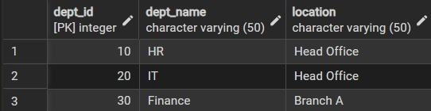
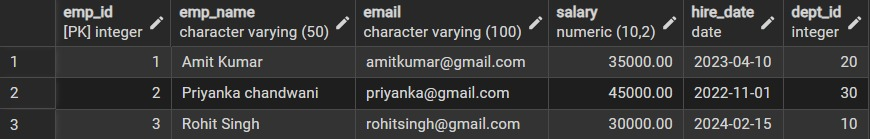
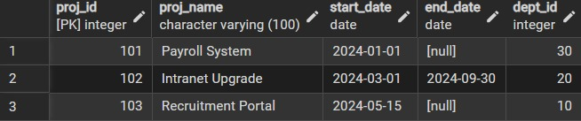
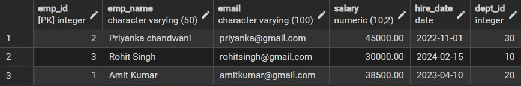
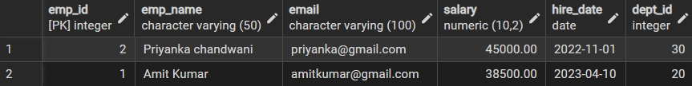
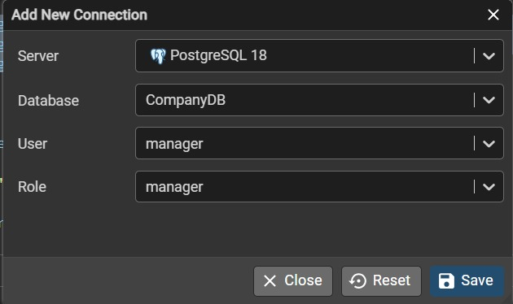
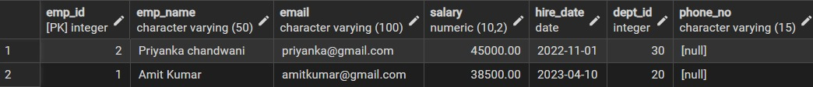
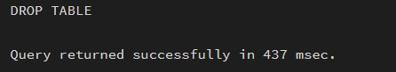

# **DBMS Lab – Worksheet 1**  
## **Design and Implementation of Sample Database System using DDL, DML and DCL**

---

## 👨‍🎓 **Student Details**  
**Name:** Priyanka Chandwani  
**UID:** 25MCI10122  
**Branch:** MCA (AI & ML)  
**Semester:** 2nd  
**Section/Group:** 1/A  
**Subject:** Technical Training  
**Subject Code:** 25CAP-652  
**Date of Performance:** 13/01/2026  

---

## 🎯 **Aim of the Session**  
To design and implement a sample database system using DDL, DML, and DCL commands for managing departments, employees, and projects, and to apply role-based access control for secure data handling.

---

## 💻 **Software Requirements**
- PostgreSQL (Database Server)  
- pgAdmin  
- Windows Operating System  

---

## 📌 **Objective of the Session**
- To understand the use of DDL commands to create and modify database structures  
- To perform DML operations such as INSERT, UPDATE, DELETE, and SELECT  
- To implement relationships using primary and foreign keys  
- To apply DCL commands to manage roles and privileges  
- To analyze input and output of SQL queries in a real database environment  

---

## 🛠️ **Practical / Experiment Steps**
- Design the database schema for Department, Employee, and Project tables  
- Create tables using appropriate constraints  
- Insert sample records into tables  
- Perform update and delete operations  
- Retrieve data using SELECT queries  
- Create a role and grant/revoke privileges  
- Alter and drop database objects  

---

## 🗄️ **Database Design**

### **Tables**
- Department  
- Employee  
- Project  

### **Constraints Used**
- PRIMARY KEY  
- FOREIGN KEY  
- NOT NULL  
- UNIQUE  
- CHECK  

---

# ⚙️ **Procedure of the Practical**

## ⚙️ **Step 1: Table Creation (DDL)**

### **Department Table**
```sql
CREATE TABLE Department (
    dept_id INT PRIMARY KEY,
    dept_name VARCHAR(50) NOT NULL UNIQUE,
    location VARCHAR(50) NOT NULL
);
```

### **Employee Table**
```sql
CREATE TABLE Employee (
    emp_id       INT PRIMARY KEY,
    emp_name     VARCHAR(50) NOT NULL,
    email        VARCHAR(100) NOT NULL UNIQUE,
    salary       DECIMAL(10,2) NOT NULL,
    hire_date    DATE NOT NULL,
    dept_id      INT NOT NULL,
    CONSTRAINT fk_emp_dept
        FOREIGN KEY (dept_id)
        REFERENCES Department(dept_id),
    CONSTRAINT chk_salary
        CHECK (salary >= 10000)
);
```

### **Project Table**
```sql
CREATE TABLE Project (
    proj_id      INT PRIMARY KEY,
    proj_name    VARCHAR(100) NOT NULL UNIQUE,
    start_date   DATE NOT NULL,
    end_date     DATE,
    dept_id      INT NOT NULL,
    CONSTRAINT fk_proj_dept
        FOREIGN KEY (dept_id)
        REFERENCES Department(dept_id),
    CONSTRAINT chk_dates
        CHECK (end_date IS NULL OR end_date >= start_date)
);
```

---

# 🧾 **Step 2: Data Manipulation (DML)**  

### **Insert into Department**
```sql
INSERT INTO Department (dept_id, dept_name, location) VALUES
(10, 'HR','Head Office'),
(20, 'IT','Head Office'),
(30, 'Finance','Branch A');
```


### **Insert into Employee**
```sql
INSERT INTO Employee (emp_id, emp_name, email, salary, hire_date, dept_id) VALUES
(1, 'Amit Kumar',   'amitkumar@gmail.com',   35000, '2023-04-10', 20),
(2, 'Priyanka chandwani', 'priyanka@gmail.com', 45000, '2022-11-01', 30),
(3, 'Rohit Singh',  'rohitsingh@gmail.com',  30000, '2024-02-15', 10);
```


### **Insert into Project**
```sql
INSERT INTO Project (proj_id, proj_name, start_date, end_date, dept_id) VALUES
(101, 'Payroll System',      '2024-01-01', NULL,        30),
(102, 'Intranet Upgrade',    '2024-03-01', '2024-09-30',20),
(103, 'Recruitment Portal',  '2024-05-15', NULL,        10);
```


---

# ✏️ **Step 3: UPDATE Operation**  
```sql
UPDATE Employee
SET salary = salary * 1.10
WHERE dept_id = 20;
```


---

# 🗑️ **Step 4: DELETE Operations**  


```sql
DELETE FROM Employee
WHERE dept_id = 10;

```


---

# 🔐 **Step 5: Create Role and Assign Privileges**

### **Create Role**
```sql
CREATE user manager with password Manager@123;
```



### **Grant SELECT Privileges**
```sql
GRANT SELECT ON Department TO manager;
GRANT SELECT ON Employee TO manager;
GRANT SELECT ON Project TO manager;
```

### **Revoke Privilege**
```sql
REVOKE CREATE ON SCHEMA public FROM manager;
REVOKE INSERT, UPDATE, DELETE ON ALL TABLES IN SCHEMA public FROM manager;
```

---

# 🏗️ **Step 6: Schema Modification**

### **Add Column**
```sql
ALTER TABLE Employee
ADD phone_no VARCHAR(15);
```


### **Drop Table**
```sql
drop table Project;
```


---
## 📥📤 I/O Analysis (Input / Output)

### 🔹 Input
- Department, Employee, and Project table creation queries  
- Records inserted into all tables using INSERT commands  
- Update query to modify employee department  
- Delete queries to remove project and employee records  
- Role creation and privilege assignment queries  
- ALTER and DROP table commands  

### 🔹 Output
- Department, Employee, and Project tables created successfully  
- Records inserted, updated, and deleted correctly  
- Referential integrity maintained between tables  
- Data displayed correctly using SELECT queries  
- Role-based access verified using GRANT and REVOKE  
- Table structure modified and Project table dropped successfully  

📸 Screenshots of execution and obtained results are attached.

---

## 📘 **Learning Outcomes**  
- Understood the basics of relational database design using tables, keys, and relationships.  
- Learned to apply primary and foreign key constraints to maintain data integrity.  
- Gained hands-on experience with INSERT, UPDATE, and DELETE operations.  
- Understood role-based access control using GRANT and REVOKE.  
- Learned how to create read-only users for secure data access.  
- Practiced ALTER TABLE and DROP TABLE commands for schema management.  

---
