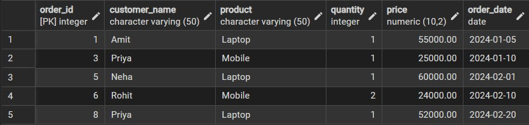
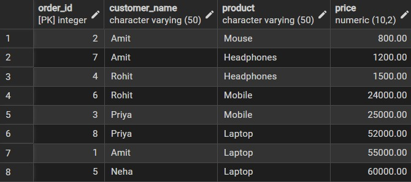
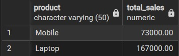
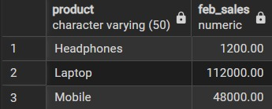
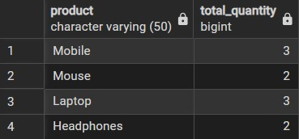

# **DBMS Lab – Worksheet 2**  
## **Implementation of SELECT Queries with Filtering, Grouping and Sorting in PostgreSQL**

---

## 👨‍🎓 **Student Details**  
**Name:** Priyanka Chandwani

**UID:** 25MCI10122  
**Branch:** MCA (AI & ML)  
**Semester:** 2nd  
**Section/Group:** 1/A  
**Subject:** DBMS Lab  
**Date of Performance:** 13/01/2026  

---

## 🎯 **Aim of the Session**  
To implement and analyze SQL SELECT queries using filtering, sorting, grouping, and aggregation concepts in PostgreSQL for efficient data retrieval and analytical reporting.

---

## 💻 **Software Requirements**

- PostgreSQL (Database Server)  
- pgAdmin
- Windows Operating System  

---

## 📌 **Objective of the Session**  
- To retrieve specific data using filtering conditions  
- To sort query results using single and multiple attributes  
- To perform aggregation using grouping techniques  
- To apply conditions on aggregated data using HAVING clause  
- To understand real-world analytical queries commonly asked in placement interviews  

---

## 🛠️ **Practical / Experiment Steps**  
- Create a sample table representing customer orders  
- Insert realistic records into the table  
- Retrieve filtered data using WHERE clause  
- Sort query results using ORDER BY  
- Group records and apply aggregate functions  
- Apply conditions on grouped data using HAVING  
- Analyze execution order of WHERE and HAVING clauses  

---

# ⚙️ **Procedure of the Practical**


## **Step 1: Database and Table Creation**

```sql
CREATE DATABASE lab_exp2;
```

```sql
CREATE TABLE customer_orders (
    order_id      SERIAL PRIMARY KEY,
    customer_name VARCHAR(50) NOT NULL,
    product       VARCHAR(50) NOT NULL,
    quantity      INT NOT NULL,
    price         NUMERIC(10,2) NOT NULL,
    order_date    DATE NOT NULL
);

INSERT INTO customer_orders
(customer_name, product, quantity, price, order_date)
VALUES
('Amit',   'Laptop',      1, 55000, '2024-01-05'),
('Amit',   'Mouse',       2,   800, '2024-01-05'),
('Priya',  'Mobile',      1, 25000, '2024-01-10'),
('Rohit',  'Headphones',  1,  1500, '2024-01-12'),
('Neha',   'Laptop',      1, 60000, '2024-02-01'),
('Rohit',  'Mobile',      2, 24000, '2024-02-10'),
('Amit',   'Headphones',  1,  1200, '2024-02-15'),
('Priya',  'Laptop',      1, 52000, '2024-02-20');

```


---

## **Step 2: Filtering Data Using Conditions (WHERE)**

```sqlprice > 20000
SELECT *
FROM customer_orders
WHERE price > 20000;
```


---

## **Step 3: Sorting Query Results (ORDER BY)**

```sql
SELECT order_id, customer_name, product, price
FROM customer_orders
ORDER BY price ASC;
```


---

## **Step 4: Grouping Data for Aggregation (GROUP BY)**

```sql
SELECT product,
SUM(quantity) AS total_quantity
FROM customer_orders
GROUP BY product;
```


---

## **Step 5:Applying Conditions on Aggregated Data (HAVING)**

### **Ascending Order**
```sql
SELECT product,
SUM(quantity * price) AS total_sales
FROM customer_orders
GROUP BY product
HAVING SUM(quantity * price) > 50000;
```



---

## **Step 6: Filtering vs Aggregation Conditions**

```sql
SELECT product,
SUM(quantity * price) AS feb_sales
FROM customer_orders
WHERE order_date >= '2024-02-01'
  AND order_date <= '2024-02-29'
GROUP BY product;
```


---


## 📥📤 **I/O Analysis (Input / Output)**

### **Input**
- Customer order details  
- Filtering, sorting, grouping, and aggregation queries  

### **Output**
- Filtered customer records  
- Sorted result sets  
- Group-wise sales summary  
- Aggregated revenue reports  

📸 Screenshots of execution and output are attached in this repository.

---

## 📘 **Learning Outcomes**  
- Students understand how data can be filtered to retrieve only relevant records.  
- Students learn how sorting improves readability and usefulness of reports.  
- Students gain the ability to group data for analytical purposes.  
- Students clearly differentiate between WHERE and HAVING clauses.  
- Students develop confidence in writing analytical SQL queries.  
- Students are better prepared for SQL-based placement and interview questions.

---

## 📂 **Repository Contents**
- README.md  
- Worksheet (Word & PDF)  
- SQL Queries  
- Screenshots  

---
