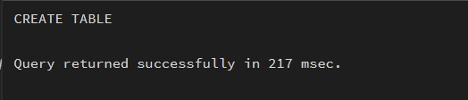
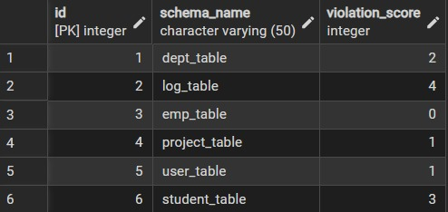
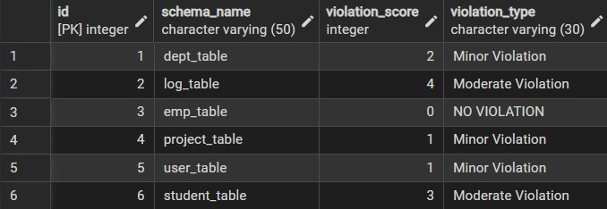
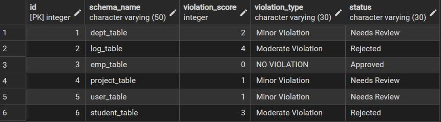
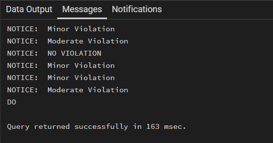
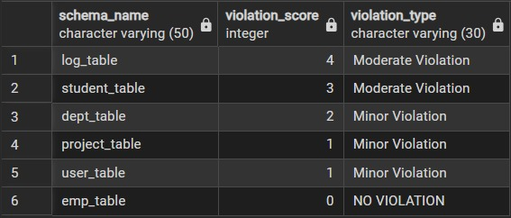

# Experiment 03 – Conditional Logic Using CASE and IF–ELSE

## Student Information

- Name: Priyanka Chandwani
- UID: 25MCI10122
- Branch: MCA (AI & ML)
- Section: MAM-1 A
- Semester: Second Semester
- Subject: Technical Skills
- Date of Performance: 27/01/2026

---

## Aim

To implement conditional decision-making logic in PostgreSQL using CASE expressions and IF–ELSE constructs for classification, validation, and rule-based data processing.

---

## Software Requirements

- PostgreSQL
- pgAdmin
- Oracle Database Express Edition (optional)

---

## Objectives

- Understand conditional execution in SQL
- Implement decision-making logic using CASE expressions
- Simulate real-world rule validation scenarios
- Classify data based on multiple conditions
- Strengthen SQL logic skills required in interviews and backend systems

---

## Step 1: Classifying Data Using CASE Expression

```sql
create table schema_Analysis
(
id int primary key,
schema_name varchar(50),
violation_score int
)

```



```sql
insert into schema_Analysis values(1,'dept_table',2),
(2,'log_table',4),
(3,'emp_table',0),
(4,'project_table',1),
(5,'user_table',1),
(6,'student_table',3)

select* from schema_Analysis

```

### Output



```sql

ALTER TABLE schema_analysis
ADD COLUMN violation_type VARCHAR(30);

UPDATE schema_Analysis
SET violation_type =
    CASE
        WHEN violation_score = 0 THEN 'NO VIOLATION'
        WHEN violation_score BETWEEN 1 AND 2 THEN 'Minor Violation'
        WHEN violation_score BETWEEN 3 AND 4 THEN 'Moderate Violation'
        ELSE 'Critical Violation'
    END;

```

### Output



---

## Step 2: Applying CASE Logic in Data Updates

```sql
ALTER TABLE schema_analysis
ADD COLUMN status VARCHAR(30);

UPDATE schema_Analysis
SET status =
    CASE
        WHEN violation_score = 0 THEN 'Approved'
        WHEN violation_score BETWEEN 1 AND 2 THEN 'Needs Review'
        ELSE 'Rejected'
    END;
```

### Output



---

## Step 3: Implementing IF–ELSE Logic Using PL/pgSQL

```sql
DO $$
DECLARE
    r RECORD;
BEGIN
    FOR r IN
        SELECT violation_count
        FROM system_analysis
    LOOP
        IF r.violation_count = 0 THEN
            RAISE NOTICE 'NO VIOLATION';
        ELSIF r.violation_count BETWEEN 1 AND 2 THEN
            RAISE NOTICE 'Minor Violation';
        ELSIF r.violation_count BETWEEN 3 AND 4 THEN
            RAISE NOTICE 'Moderate Violation';
        ELSE
            RAISE NOTICE 'Critical Violation';
        END IF;
    END LOOP;
END $$;
```

### Output



---

## Step 4: Real-World Classification Scenario (Grading System)

```sql
create table student (
id int primary key ,
name varchar(50),
marks int
)

INSERT INTO student (id, name, marks) VALUES
(1, 'Amit', 85),
(2, 'Neha', 72),
(3, 'Rohan', 90),
(4, 'Simran', 65),
(5, 'Ankit', 40);

select * from student;

ALTER TABLE student
ADD COLUMN grade VARCHAR(2);

DO $$
DECLARE
    r RECORD;
BEGIN
    FOR r IN SELECT id, marks FROM student
    LOOP
        IF r.marks >= 90 THEN
            UPDATE student SET grade = 'A' WHERE id = r.id;
        ELSIF r.marks >= 75 THEN
            UPDATE student SET grade = 'B' WHERE id = r.id;
        ELSIF r.marks >= 50 THEN
            UPDATE student SET grade = 'C' WHERE id = r.id;
        ELSE
            UPDATE student SET grade = 'F' WHERE id = r.id;
        END IF;
    END LOOP;
END $$;
```

### Output


---

## Step 5: Using CASE for Custom Sorting

```sql
SELECT
    schema_name,
    violation_score,
    violation_type
FROM schema_Analysis
ORDER BY
    CASE
        WHEN violation_type = 'Critical Violation' THEN 1
        WHEN violation_type = 'Moderate Violation' THEN 2
        WHEN violation_type = 'Minor Violation' THEN 3
        ELSE 4
    END,schema_name;
```

### Output



---

## Learning Outcomes

- Implemented CASE expressions for classification
- Used IF–ELSE procedural logic
- Applied conditional updates
- Performed rule-based sorting
- Improved backend SQL decision logic

---

## Conclusion

This worksheet demonstrated practical implementation of conditional logic in PostgreSQL using CASE and IF–ELSE constructs for real-world scenarios.
