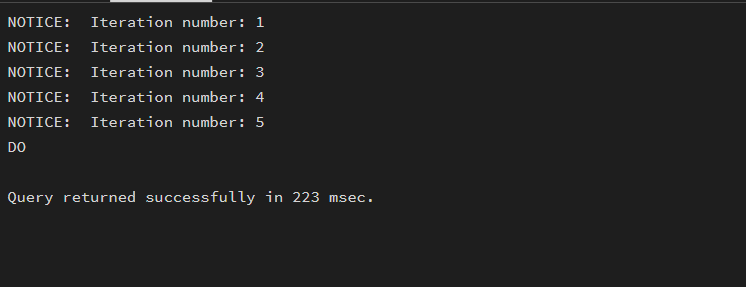
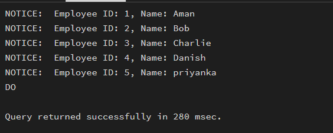
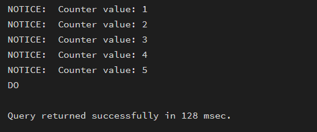
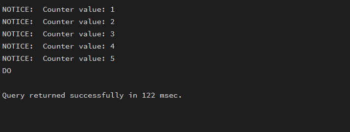
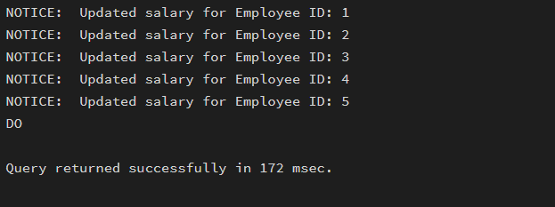
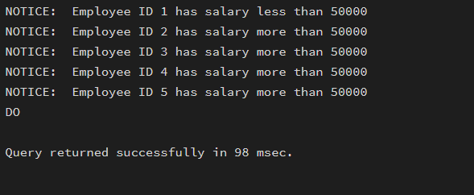

# MCA Experiment 04 – Iterative Control Structures in PostgreSQL

> **Student Name:** Priyanka Chandwani  
> **UID:** 25MCI10122  
> **Branch:** MCA (AI & ML)  
> **Section/Group:** 25MAM_KAR-1  
> **Semester:** 2  
> **Date of Performance:** 3/2/26  
> **Subject Name:** Technical Training  
> **Subject Code:** 25CAP-652 

---

## EXPERIMENT - 04

**Implementation of Iterative Control Structures using FOR, WHILE, and LOOP in PostgreSQL** 

---

## Aim

To understand and implement iterative control structures in PostgreSQL conceptually, including FOR loops, WHILE loops, and basic LOOP constructs, for repeated execution of database logic. 

---

## Tools Used

- PostgreSQL 

---

## Objectives

- To understand why iteration is required in database programming.   
- To learn the purpose and behavior of FOR, WHILE, and LOOP constructs.   
- To understand how repeated data processing is handled in databases.   
- To relate loop concepts to real-world batch processing scenarios.   
- To strengthen conceptual knowledge of procedural SQL used in enterprise systems. 

---

## Experiment Steps

## Step 1: FOR Loop -- Simple Iteration

```sql
DO $$
BEGIN
    FOR i IN 1..5 LOOP
        RAISE NOTICE 'Iteration number: %', i;
    END LOOP;
END;
$$;
```
### Output-


---

### Example 2: FOR Loop with Query (Row-by-Row Processing)

```sql
CREATE TABLE employees (
    employee_id SERIAL PRIMARY KEY,
    employee_name VARCHAR(50),
    salary NUMERIC(10,2)
);

INSERT INTO employees (employee_name, salary) VALUES
('Aman', 40000),
('Bob', 55000),
('Charlie', 48000),
('Danish', 60000),
('priyanka', 52000);

DO $$
DECLARE
    emp_rec RECORD;
BEGIN
    FOR emp_rec IN
        SELECT employee_id, employee_name FROM employees
    LOOP
        RAISE NOTICE 'Employee ID: %, Name: %',
            emp_rec.employee_id, emp_rec.employee_name;
    END LOOP;
END;
$$;
``` 

### Output-


---

### Example 3: WHILE Loop -- Conditional Iteration

```sql
DO $$
DECLARE
    counter INT := 1;
BEGIN
    WHILE counter <= 5 LOOP
        RAISE NOTICE 'Counter value: %', counter;
        counter := counter + 1;
    END LOOP;
END;
$$;
``` 

### Output-


---

### Example 4: LOOP with EXIT WHEN

```sql
DO $$
DECLARE
    counter INT := 1;
BEGIN
    LOOP
        RAISE NOTICE 'Counter value: %', counter;
        counter := counter + 1;
        EXIT WHEN counter > 5;
    END LOOP;
END;
$$;
``` 

### Output-


---

### Example 5: Salary Increment Using FOR Loop

```sql
DO $$
DECLARE
    emp_rec RECORD;
BEGIN
    FOR emp_rec IN
        SELECT employee_id, salary FROM employees
    LOOP
        UPDATE employees
        SET salary = salary * 1.10
        WHERE employee_id = emp_rec.employee_id;

        RAISE NOTICE 'Updated salary for Employee ID: %',
            emp_rec.employee_id;
    END LOOP;
END;
$$;
``` 

### Output-


---

### Example 6: Combining LOOP with IF Condition

```sql
DO $$
DECLARE
    emp_rec RECORD;
BEGIN
    FOR emp_rec IN
        SELECT employee_id, salary FROM employees
    LOOP
        IF emp_rec.salary > 50000 THEN
            RAISE NOTICE 'Employee ID % has salary more than 50000',
                emp_rec.employee_id;
        ELSE
            RAISE NOTICE 'Employee ID % has salary less than 50000',
                emp_rec.employee_id;
        END IF;
    END LOOP;
END;
$$;
``` 

### Output-


---

## Learning Outcomes

- Understand the need for iteration in database applications.
- Identify and use different loop types (FOR, WHILE, LOOP).
- Implement fixed and query-based repetition for row processing.
- Apply conditional and exit-controlled loops for automation tasks.
- Use PL/pgSQL loops in real-world scenarios like payroll, reporting, and batch processing.

---

## Conclusion

This experiment helps students understand how iterative control structures work in PostgreSQL at a conceptual level. Students learn where and why loops are used in database systems and gain foundational knowledge required for writing procedural logic in enterprise-grade applications. 
