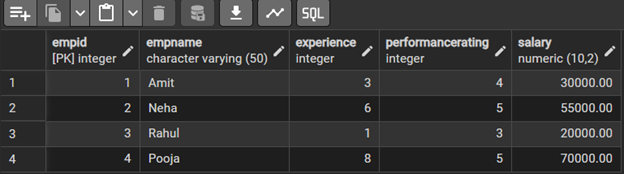
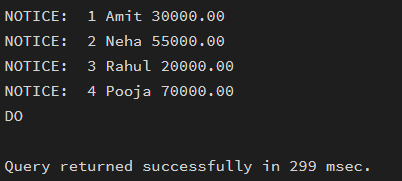
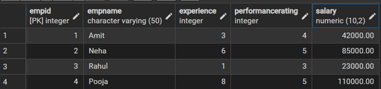
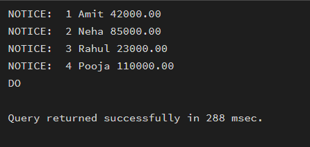

# MCA Experiment 05 – Cursors in PostgreSQL

> **Student Name:** Priyanka Chandwani  
> **UID:** 25MCI10122  
> **Branch:** MCA (AI & ML)  
> **Section/Group:** 25MAM-1-A  
> **Semester:** 2  
> **Date of Performance:** 24.02.2026  
> **Subject Name:** Technical Training  
> **Subject Code:** 25CAP-652 

---

## EXPERIMENT - 05

**Implementation of Cursors for Row-by-Row Processing in PostgreSQL**

---

## Aim

To gain hands-on experience in creating and using cursors for row-by-row processing in a database, enabling sequential access and manipulation of query results for complex business logic.

---

## Tools Used

- PostgreSQL 

---

## Objectives

- Sequential Data Access: To understand how to fetch rows one by one from a result set using cursor mechanisms.
- Row-Level Manipulation: To perform specific operations or calculations on individual records that require conditional procedural logic.
- Resource Management: To learn the lifecycle of a cursor (Declaring, Opening, Fetching, Closing and Deallocating).
- Exception Handling: To handle cursor-related errors and performance considerations during large-scale data iteration.

---

## Experiment Steps

## Step 1: Table Creation and Data Population

```sql
CREATE TABLE Employee (
    EmpID INT PRIMARY KEY,
    EmpName VARCHAR(50),
    Experience INT,
    PerformanceRating INT,
    Salary DECIMAL(10,2)
);

INSERT INTO Employee VALUES
(1, 'Amit', 3, 4, 30000),
(2, 'Neha', 6, 5, 55000),
(3, 'Rahul', 1, 3, 20000),
(4, 'Pooja', 8, 5, 70000);

SELECT * FROM Employee;
```


---


## Step 2: Simple Forward-Only Cursor
Creating a cursor to loop through Employee table and print individual records.

```sql
DO
$$
DECLARE
    empcursor CURSOR FOR SELECT * FROM Employee;
    emprow RECORD;
BEGIN
    OPEN empcursor;
    LOOP
        FETCH empcursor INTO emprow;
        EXIT WHEN NOT FOUND;
        RAISE NOTICE '% | % | %', emprow.EmpID, emprow.EmpName, emprow.Salary;
    END LOOP;
    CLOSE empcursor;
END
$$;
```


---

## Step 3: Complex Row-by-Row Manipulation with Cursor
Using cursor to update salaries based on dynamic Experience-to-Performance ratio logic.

```sql
DO
$$
DECLARE
    empcursor CURSOR FOR SELECT * FROM Employee;
    emprow RECORD;
    increment INT;
BEGIN
    OPEN empcursor;
    LOOP
        FETCH empcursor INTO emprow;
        EXIT WHEN NOT FOUND;
        increment := emprow.Experience * emprow.PerformanceRating * 1000;
        UPDATE Employee SET Salary = Salary + increment WHERE EmpID = emprow.EmpID;
    END LOOP;
    CLOSE empcursor;
END
$$;

SELECT * FROM Employee;

```



---

## Step 4: Cursor with Exception Handling
Ensuring cursor handles empty result sets or termination signals gracefully.

```sql
DO
$$
DECLARE
    empcursor CURSOR FOR SELECT * FROM Employee;
    emprow RECORD;
BEGIN
    OPEN empcursor;
    LOOP
        FETCH empcursor INTO emprow;
        EXIT WHEN NOT FOUND;
        RAISE NOTICE '% | % | %', emprow.EmpID, emprow.EmpName, emprow.Salary;
    END LOOP;
    CLOSE empcursor;
EXCEPTION
    WHEN OTHERS THEN
        RAISE NOTICE 'Cursor Error Occurred';
END
$$;

```


---

## Learning Outcomes
-Cursor Implementation: Students will be able to design, implement, and manage cursors to solve row-wise processing problems.

-Lifecycle Mastery: Students will demonstrate correct syntax for declaring, opening, fetching, and closing cursors.

-Error Prevention: Students will understand how to properly handle row-by-row processing exceptions and prevent memory leaks.

-Analytical Thinking: Students will be able to apply cursor-based logic to solve real-world scenarios like payroll adjustments and data migrations.

---

## Conclusion
This experiment demonstrates the power of cursors in PostgreSQL for efficient row-by-row processing. Students gain practical experience in cursor lifecycle management, exception handling, and applying cursors to real-world business logic scenarios essential for enterprise database applications.