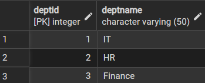
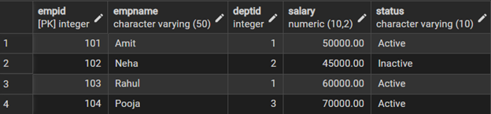
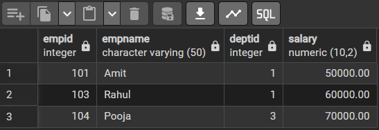
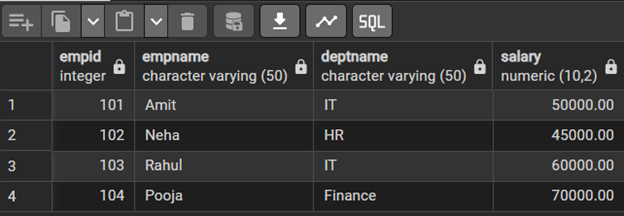

# Experiment 6 – SQL Views using PostgreSQL

**Student Name:** Priyanka Chandwani  
**UID:** 25MCI10122  
**Branch:** MCA (AI & ML)  
**Section/Group:** 25MAM-1-A  
**Semester:** 2nd  
**Date of Performance:** 24-02-2026

**Subject Name:** Technical Training  
**Subject Code:** 25CAP-652

---

## Experiment Aim

To learn how to create, query, and manage **views in SQL** to simplify database queries and provide a layer of abstraction for end-users.

**Company Tags:** Amazon, Zoho, ServiceNow

**Tools Used:** PostgreSQL

---

## Objectives

- **Data Abstraction:** Hide complex joins and calculations behind simple virtual tables.
- **Enhanced Security:** Restrict access to sensitive data using views instead of direct table access.
- **Query Simplification:** Simplify multi-table queries for easy reporting.
- **View Management:** Learn syntax for creating, altering, and dropping views efficiently.

---

## Experiment Steps

---

### Table Creation and Data Insertion

#### Create Tables

```sql
CREATE TABLE Departments (
    DeptID INT PRIMARY KEY,
    DeptName VARCHAR(50)
);

CREATE TABLE Employees (
    EmpID INT PRIMARY KEY,
    EmpName VARCHAR(50),
    DeptID INT,
    Salary NUMERIC(10,2),
    Status VARCHAR(10),
    FOREIGN KEY (DeptID) REFERENCES Departments(DeptID)
);
```

#### Insert Data

```sql
INSERT INTO Departments VALUES
(1,'IT'),
(2,'HR'),
(3,'Finance');

INSERT INTO Employees VALUES
(101,'Amit',1,50000,'Active'),
(102,'Neha',2,45000,'Inactive'),
(103,'Rahul',1,60000,'Active'),
(104,'Pooja',3,70000,'Active');
```

#### View Tables

```sql
SELECT * FROM Departments;
SELECT * FROM Employees;
```



---

## Step 1: Creating a Simple View (Filtering Active Employees)

```sql
CREATE VIEW ActiveEmployees AS
SELECT EmpID, EmpName, DeptID, Salary
FROM Employees
WHERE Status = 'Active';

SELECT * FROM ActiveEmployees;
```



---

## Step 2: Creating a View for Joining Multiple Tables

```sql
CREATE VIEW EmpDeptView AS
SELECT
    e.EmpID,
    e.EmpName,
    d.DeptName,
    e.Salary
FROM Employees e
JOIN Departments d ON e.DeptID = d.DeptID;

SELECT * FROM EmpDeptView;
```



---

## Step 3: Advanced Summarization (Department Salary Statistics)

```sql
CREATE VIEW DeptSalaryStats AS
SELECT
    d.DeptName,
    COUNT(e.EmpID) AS TotalEmployees,
    SUM(e.Salary) AS TotalSalary,
    AVG(e.Salary) AS AvgSalary
FROM Employees e
JOIN Departments d ON e.DeptID = d.DeptID
GROUP BY d.DeptName;

SELECT * FROM DeptSalaryStats;
```



---

## Outcomes

- **Abstraction Proficiency:** Ability to create and query views for efficient data access.
- **Security Implementation:** Understanding restricted data access using views.
- **Syntactic Accuracy:** Correct usage of SQL syntax for creating and querying views.
- **Real-world Application:** Ability to design views for payroll systems, HR management, and reporting systems.

---

## Conclusion

This experiment successfully demonstrated the use of **SQL views** for abstraction, security, simplification, and reporting. Views improve maintainability, security, and readability of complex database queries, making them highly useful in enterprise-level applications.
