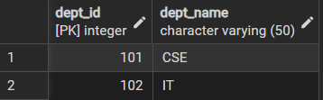
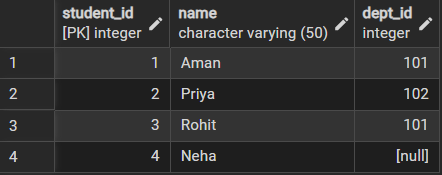
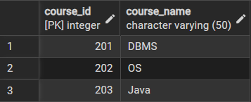
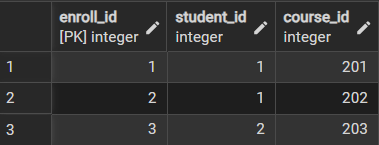
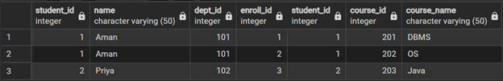
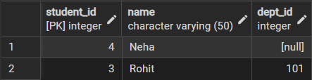
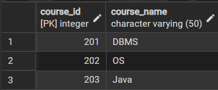
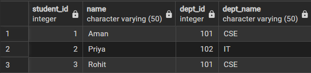
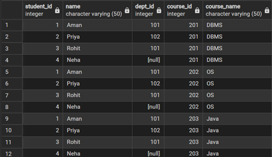

**Student Name : Priyanka Chandwani**
**UID: 25MCI10122**
**Branch : MCA (AI & ML)**
**Section/Group : 25MAM-1-A**
**Semester : 2nd**
**Date of Performance: 31.03.2026**
**Subject Name : Technical Training**
**Subject Code : 25CAP-652**

### **Experiment 7:**

**Experiment Aim:** Implementation of JOINS in PostgreSQL

**Tools used:** PostgreSQL

**Objectives**

- **Apply joins to a real-world database schema (e.g., Students, Courses, Enrollments, Departments)**

**Experiment Steps:**

#### **Table Creation and Data Storing-**

```sql
CREATE TABLE Students (
    student_id int PRIMARY KEY,
    name VARCHAR(50),
    dept_id int
);

CREATE TABLE Courses (
    course_id int PRIMARY KEY,
    course_name VARCHAR(50)
);

CREATE TABLE Enrollments (
    enroll_id int PRIMARY KEY,
    student_id int,
    course_id int,
    FOREIGN KEY (student_id) REFERENCES Students(student_id),
    FOREIGN KEY (course_id) REFERENCES Courses(course_id)
);

CREATE TABLE Departments (
    dept_id int PRIMARY KEY,
    dept_name VARCHAR(50)
);
```

```sql
INSERT INTO Departments VALUES (101, 'CSE');
INSERT INTO Departments VALUES (102, 'IT');
```



```sql
INSERT INTO Students VALUES (1, 'Aman', 101);
INSERT INTO Students VALUES (2, 'Priya', 102);
INSERT INTO Students VALUES (3, 'Rohit', 101);
INSERT INTO Students VALUES (4, 'Neha', NULL);
```



```sql
INSERT INTO Courses VALUES (201, 'DBMS');
INSERT INTO Courses VALUES (202, 'OS');
INSERT INTO Courses VALUES (203, 'Java');
```



```sql
INSERT INTO Enrollments VALUES (1, 1, 201);
INSERT INTO Enrollments VALUES (2, 1, 202);
INSERT INTO Enrollments VALUES (3, 2, 203);
```



**Step 1: Write queries to list students with their enrolled courses (INNER JOIN).**

```sql
SELECT students.*,
       enrollments.*,
       courses.course_name
FROM students,
     enrollments,
     courses
WHERE students.student_id = enrollments.student_id
  AND courses.course_id = enrollments.course_id;
```



**Step 2: Find students not enrolled in any course (LEFT JOIN).**

```sql
SELECT students.*
FROM students
LEFT JOIN enrollments
    ON students.student_id = enrollments.student_id
LEFT JOIN courses
    ON courses.course_id = enrollments.course_id
WHERE courses.course_id IS NULL;
```



**Step 3: Display all courses with or without enrolled students (RIGHT JOIN).**

```sql
SELECT courses.*
FROM enrollments
RIGHT JOIN courses
    ON courses.course_id = enrollments.course_id;
```



**Step 4: Show students with department info using SELF JOIN or multiple joins.**

```sql
SELECT students.*,
       departments.dept_name
FROM students
INNER JOIN departments
    ON students.dept_id = departments.dept_id;
```



**Step 5:** **Display all possible student-course combinations (CROSS JOIN). (Oracle, SAP, IBM, Microsoft)**

```sql
SELECT *
FROM students
CROSS JOIN courses;
```



**Outcomes:**

- **Abstraction Proficiency:** Students will be able to create and query views to simplify efficient data access and abstraction.
- **Security Implementation:** Students will understand how to use views for data masking and providing restricted access to sensitive information.
- **Syntactic Accuracy:** Students will demonstrate the correct syntax for creating and querying views, ensuring logical clarity in naming conventions.
- **Real-world Application:** Students will be able to design views for practical domains like Library Management Systems or Payroll Systems to demonstrate functionality.
