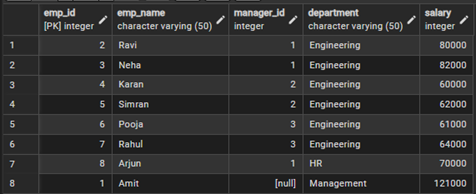
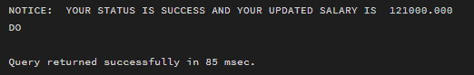

**Student Name: Priyanka Chandwani**

**UID: 25MCI10122**

**Branch: M.C.A(A.l & M.L)**

**Section/Group: MAM-1 A**

**Semester: Second Sem**

**Date of Performance:12/01/2026**

**Subject Name: TECHINCAL SKILLS**

WORKSHEET 8

**AIM:** To apply the concept of Stored Procedures in database operations in order to perform tasks like insertion, updating, deletion, and retrieval of data efficiently, securely, and in a reusable manner within the database system.

**S/W Requirement:** Oracle Database Express Edition and pgAdmin

**OBJECTIVES:**

1. To understand the concept and usage of stored procedures in database systems.
2. To implement stored procedures for performing CRUD operations efficiently.
3. To enhance data security by restricting direct access through stored procedures.
4. To reduce code redundancy by using reusable database procedures.
5. To improve performance of database operations using precompiled stored procedures.

**Practical / Experiment Steps**

**Tables Creation & Insertion**


**Step 1. Create or replace a procedure for Updating Employee Salaries**

```sql
CREATE OR REPLACE PROCEDURE update_salary_proc(
    IN P_EMP_ID INT,
    INOUT P_SALARY NUMERIC(20,3),
    OUT STATUS VARCHAR(20)
)
AS
$$
DECLARE
    CURR_SAL NUMERIC(20,3);
BEGIN
    SELECT SALARY + P_SALARY
    INTO CURR_SAL
    FROM employees
    WHERE EMP_ID = P_EMP_ID;

    IF NOT FOUND THEN
        RAISE EXCEPTION 'EMPLOYEE NOT FOUND';
    END IF;

    UPDATE employees
    SET salary = curr_sal
    WHERE emp_id = p_emp_id;

    P_salary := curr_sal;
    status := 'SUCCESS';

EXCEPTION
    WHEN OTHERS THEN
        IF SQLERRM LIKE '%EMPLOYEE NOT FOUND%' THEN
            STATUS := 'EMPLOYEE NOT FOUND';
        END IF;
END;
$$ LANGUAGE PLPGSQL;
```

**Step 2 Calling of Stored Procedure**

```sql
DO
$$
DECLARE
    EMP_ID INT := 1;
    STATUS VARCHAR(20);
    SALARY NUMERIC(20,3) := 500;
BEGIN
    CALL update_salary_proc(emp_id, salary, status);
    RAISE NOTICE 'YOUR STATUS IS % AND YOUR UPDATED SALARY IS %', STATUS, salary;
END;
$$;
```

**Output:**





**Outcomes:**

1. To demonstrate the ability to create and execute stored procedures for various database operations.
2. To apply stored procedures for performing secure and efficient CRUD operations.
3. To analyze the impact of stored procedures on database performance and execution efficiency.
4. To design modular and reusable database logic using stored procedures.
