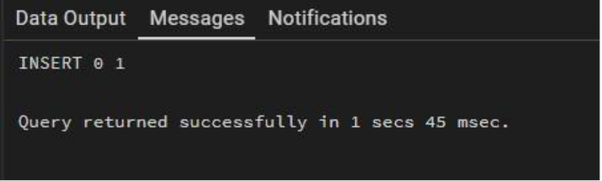
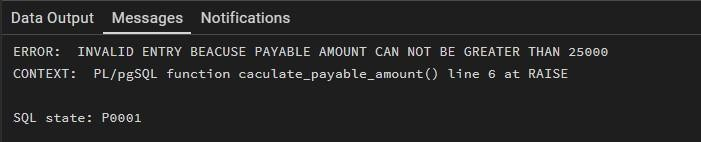
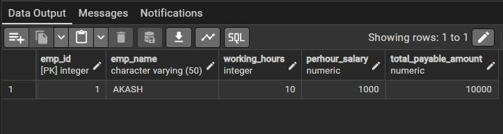

# Experiment 9: PostgreSQL Triggers

## Aim
To implement database triggers in PostgreSQL to automatically calculate values and enforce constraints during data insertion operations.

## Tools Used
- PostgreSQL

## Objectives
- Understand how to create and use triggers in PostgreSQL
- Automate calculation of total payable amount
- Enforce constraints using trigger conditions
- Execute logic automatically before inserting data

## Theory
Triggers are special database objects that automatically execute a function when a specified event (INSERT, UPDATE, DELETE) occurs on a table.

In PostgreSQL:
- Triggers are linked with functions written in PL/pgSQL
- They help maintain data integrity
- They enforce business rules
- They automate repetitive tasks

## Implementation Steps

### Step 1: Create Table
```sql
CREATE TABLE employee ( 
    emp_id INT PRIMARY KEY, 
    emp_name VARCHAR(50), 
    working_hours INT, 
    perhour_salary NUMERIC, 
    total_payable_amount NUMERIC 
);
```

### Step 2: Create Trigger Function
```sql
CREATE OR REPLACE FUNCTION calculate_payable_amount() 
RETURNS TRIGGER AS
$$ 
BEGIN
    NEW.total_payable_amount := NEW.perhour_salary * NEW.working_hours;

    IF NEW.total_payable_amount > 25000 THEN
        RAISE EXCEPTION 'INVALID ENTRY BECAUSE PAYABLE AMOUNT CANNOT BE GREATER THAN 25000';
    END IF;

    RETURN NEW; 
END;
$$ LANGUAGE plpgsql;
```

### Step 3: Create Trigger
```sql
CREATE OR REPLACE TRIGGER automated_payable_amount_calculation
BEFORE INSERT 
ON employee
FOR EACH ROW
EXECUTE FUNCTION calculate_payable_amount();
```
### Step 4: Insert Valid Data
```sql
INSERT INTO employee(emp_id, emp_name, working_hours, perhour_salary) 
VALUES (1, 'AKASH', 10, 1000);
```

### Step 5: Insert Invalid Data (Exception Case)
```sql
INSERT INTO employee(emp_id, emp_name, working_hours, perhour_salary) 
VALUES (2, 'Ankush', 8, 100000);
```

### Step 6: Retrieve Data
```sql
SELECT * FROM employee;
```

## Outcomes
- Learned how to create and use triggers in PostgreSQL
- Understood automation of calculations using triggers
- Implemented constraints using trigger conditions
- Gained knowledge of real-time database logic execution

## Author
Sahil Hans  
MCA (AI & ML)  
Chandigarh University
