# Hostel Management System – DBMS Mini Project

This repository contains the PostgreSQL-based **Hostel Management System** implemented as part of the MCA (AI & ML) Technical Training – I course (CAP-652) at Chandigarh University.
The project focuses on designing a relational schema, implementing constraints, triggers, functions, and demonstrating SQL operations for managing hostel operations.

---

## Project Overview

The Hostel Management System digitizes key hostel workflows such as student data management, room allocation, and complaint handling using a relational database.  
It replaces manual, error-prone processes with an automated, constraint-driven PostgreSQL schema that ensures data integrity and efficient querying.

### Core Objectives

- Design a normalized relational schema for hostel operations.
- Automate room occupancy tracking using triggers.
- Provide real-time visibility of available rooms through queries/views.
- Enforce referential integrity for student–room–complaint relationships.
- Implement a complaint management workflow with status tracking.
- Demonstrate CRUD and advanced SQL (JOIN, GROUP BY, STRING_AGG).
- Implement PL/pgSQL functions for reusable data retrieval.

---

## Tech Stack

- **Database:** PostgreSQL 14+
- **Database Tools:** pgAdmin 4
- **Languages:** SQL, PL/pgSQL
- **OS:** Windows 10/11, Ubuntu 20.04+
- **Minimum Hardware:** 4 GB RAM, 500 MB free storage
- **Editors/Tools:** VS Code (SQL extension), terminal/psql

---

## Database Design

The system is built around four main entities: **students**, **rooms**, **allocation**, and **complaints**, each mapped to a relational table.

### Entity Summary

| Entity     | Primary Key   | Key Attributes                       | Relationship description              |
| ---------- | ------------- | ------------------------------------ | ------------------------------------- |
| students   | student_id    | name, course, year                   | Has many allocations, many complaints |
| rooms      | room_id       | capacity, occupied                   | Linked to many allocations            |
| allocation | allocation_id | student_id, room_id, allocation_date | Junction between students and rooms   |
| complaints | complaint_id  | student_id, issue, status            | Each complaint belongs to one student |

### Table Structures

```sql
CREATE TABLE students (
  student_id SERIAL PRIMARY KEY,
  name       VARCHAR(100),
  course     VARCHAR(50),
  year       INT
);

CREATE TABLE rooms (
  room_id   SERIAL PRIMARY KEY,
  capacity  INT,
  occupied  INT DEFAULT 0
);

CREATE TABLE allocation (
  allocation_id   SERIAL PRIMARY KEY,
  student_id      INT REFERENCES students(student_id),
  room_id         INT REFERENCES rooms(room_id),
  allocation_date DATE DEFAULT CURRENT_DATE
);

CREATE TABLE complaints (
  complaint_id SERIAL PRIMARY KEY,
  student_id   INT REFERENCES students(student_id),
  issue        TEXT,
  status       VARCHAR(20) DEFAULT 'Pending'
);
```

---

## Constraints, Trigger, and Function

### Business Constraints

- CHECK constraint on `rooms` to prevent overbooking: `occupied <= capacity`.

```sql
ALTER TABLE rooms
ADD CONSTRAINT check_capacity
CHECK (occupied <= capacity);
```

### Trigger Logic – Room Occupancy

A trigger automatically increments room occupancy when a new allocation is inserted.

```sql
CREATE OR REPLACE FUNCTION update_occupancy()
RETURNS TRIGGER AS $$
BEGIN
  UPDATE rooms
  SET occupied = occupied + 1
  WHERE room_id = NEW.room_id;
  RETURN NEW;
END;
$$ LANGUAGE plpgsql;

CREATE TRIGGER allocate_room_trigger
AFTER INSERT ON allocation
FOR EACH ROW
EXECUTE FUNCTION update_occupancy();
```

### Helper Function – Get Student Room

```sql
CREATE OR REPLACE FUNCTION get_student_room(sid INT)
RETURNS TABLE(room_id INT) AS $$
BEGIN
  RETURN QUERY
  SELECT room_id
  FROM allocation
  WHERE student_id = sid;
END;
$$ LANGUAGE plpgsql;
```

---

## Sample Data

The project uses realistic sample data to demonstrate queries and outputs.

### Students

- 16 student records across courses: BBA, BCA, B.Tech, MCA, MSC, MBA, B.Com.

```sql
INSERT INTO students (name, course, year) VALUES
('Aman Riyaz', 'BBA', 2),
('Riya Pal', 'BCA', 1),
('Karan Kumar', 'B.Tech', 4),
('Priyanka Chandwani', 'MCA', 1),
('Sahil Hans', 'MCA', 2),
('Shubham Agarwal', 'MSC', 1),
('Harpreet Kaur', 'B.Tech', 1),
('Navdeep Singh', 'B.Tech', 2),
('Simran Sharma', 'BCA', 2),
('Rohit Verma', 'MBA', 1),
('Manpreet Gill', 'B.Tech', 3),
('Deepika Negi', 'MCA', 2),
('Arjun Malhotra', 'B.Com', 1),
('Jasleen Kaur', 'MBA', 2),
('Vishal Thakur', 'B.Tech', 4),
('Pooja Bhatia', 'MSC', 2);
```

_Output screenshot : `output/picture1.png` (Students inserted)_

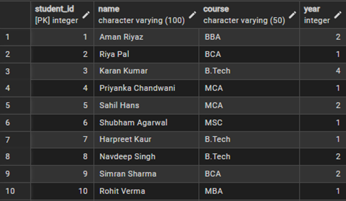

### Rooms

- 10 rooms with capacities from 1 to 4 beds, all starting with `occupied = 0`.

```sql
INSERT INTO rooms (capacity, occupied) VALUES
(2, 0), (3, 0), (4, 0), (2, 0), (3, 0),
(4, 0), (1, 0), (2, 0), (3, 0), (4, 0);
```

_Output screenshot: `output/picture2.png` (Rooms inserted)_

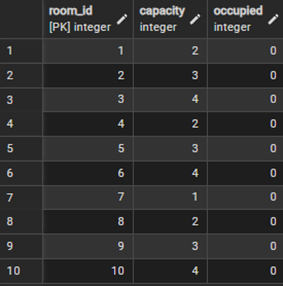

### Allocations

- 13 allocation records with trigger-based occupancy updates.

```sql
INSERT INTO allocation (student_id, room_id) VALUES
(1, 1), (2, 3), (3, 2), (4, 7), (5, 2),
(6, 5), (7, 3), (8, 6), (9, 5), (10, 8),
(11, 6), (12, 9), (13, 4);
```

_Output screenshot: `output/picture3.png` (Allocations inserted & trigger fired)_

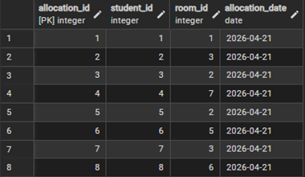

### Complaints

- 10 complaint records with different statuses (Pending, In Progress, Resolved).

```sql
INSERT INTO complaints (student_id, issue, status) VALUES
(1,  'Water supply disrupted in bathroom since 2 days', 'Pending'),
(2,  'Wi-Fi connectivity very slow after 10 PM',        'Pending'),
(3,  'Room window latch broken, security concern',      'Resolved'),
(5,  'Mess food quality has degraded this week',        'Pending'),
(7,  'AC in room not functioning, unbearable',          'In Progress'),
(8,  'Cockroach infestation noticed near washroom',     'Pending'),
(10, 'Laundry machine on 2nd floor out of order',       'Resolved'),
(11, 'Common room TV remote is missing',                'Pending'),
(13, 'Power socket near study table not working',       'In Progress'),
(6,  'Noisy neighbour disturbing studies',              'Pending');
```

_Output screenshot: `output/pictur4.png` (Complaints inserted)_

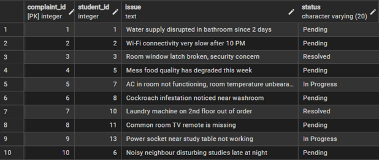

---

## Example Queries and Outputs

### 1. Students Allocated to Room 1

```sql
SELECT s.name
FROM students s
JOIN allocation a ON s.student_id = a.student_id
WHERE a.room_id = 1;
```

_Output screenshot: `output/picture5.png` (Students in Room 1)_

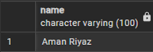

### 2. Rooms with Available Space

```sql
SELECT *
FROM rooms
WHERE occupied < capacity;
```

_Output screenshot: `output/Picture6.png` (Available rooms)_


### 3. All Pending Complaints

```sql
SELECT *
FROM complaints
WHERE status = 'Pending';
```

_Output screenshot: `output/picture7.png` (Pending complaints)_

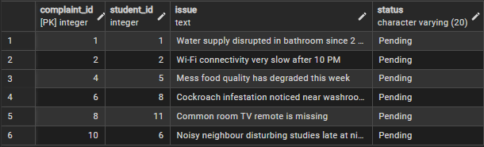

### 4. All Students Ordered by Course and Year

```sql
SELECT name, course, year
FROM students
ORDER BY course, year;
```

_Output screenshot: `output/picture8.png` (Students ordered by course & year)_

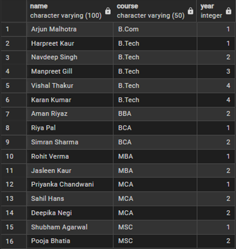

### 5. Final Year B.Tech Students

```sql
SELECT name, course, year
FROM students
WHERE year > 3 AND course = 'B.Tech';
```

_Output screenshot: `output/picture9.png` (Final year B.Tech students)_

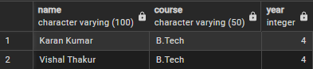

### 6. Update Queries

- Mark complaint `#1` as Resolved:

```sql
UPDATE complaints
SET status = 'Resolved'
WHERE complaint_id = 1;
```

_Output screenshot: `output/picture10.png` (Complaint 1 marked resolved)_

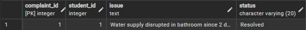

- Bulk resolve all `In Progress` complaints:

```sql
UPDATE complaints
SET status = 'Resolved'
WHERE status = 'In Progress';
```

_Output screenshot: `output/picture11.png` (Bulk resolved complaints)_

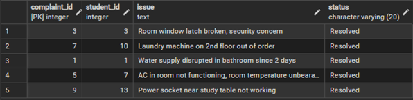

### 7. Delete Query and Advanced Report

- Delete a resolved complaint safely:

```sql
DELETE FROM complaints
WHERE complaint_id = 1
  AND status = 'Resolved';
```

_Output screenshot: `output/picture12.png` (Resolved complaint deleted)_

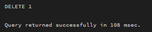

- Room-wise student list using `STRING_AGG`:

```sql
SELECT r.room_id,
       r.capacity,
       r.occupied,
       STRING_AGG(s.name, ', ') AS students_in_room
FROM rooms r
LEFT JOIN allocation a ON r.room_id = a.room_id
LEFT JOIN students s ON a.student_id = s.student_id
GROUP BY r.room_id, r.capacity, r.occupied
ORDER BY r.room_id;
```

_Output screenshot: `output/picture13.png` (Room-wise consolidated student list)_

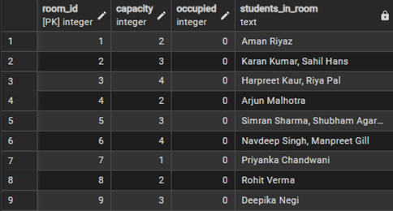

---

## How to Run

1. Install PostgreSQL 14+ and pgAdmin 4 on your system.
2. Create a new database, e.g. `hostel_management`.
3. Open pgAdmin/psql and connect to the database.
4. Execute the SQL scripts in this order:
   - Create tables (`students`, `rooms`, `allocation`, `complaints`).
   - Add constraints and trigger function.
   - Create `allocate_room_trigger` and `get_student_room()` function.
   - Insert sample data (students, rooms, allocations, complaints).
5. Run the SELECT/UPDATE/DELETE queries to reproduce the outputs and compare with `output/picture*.png`.

---

## Results and Learning Outcomes

The project demonstrates correct use of relational modeling, constraints, triggers, PL/pgSQL functions, and non-trivial SQL queries in a realistic hostel scenario.
It forms a strong backend foundation that can be extended with a web UI (e.g., React, Django), REST APIs, and role-based access control for a production-ready Hostel Management System.
s
